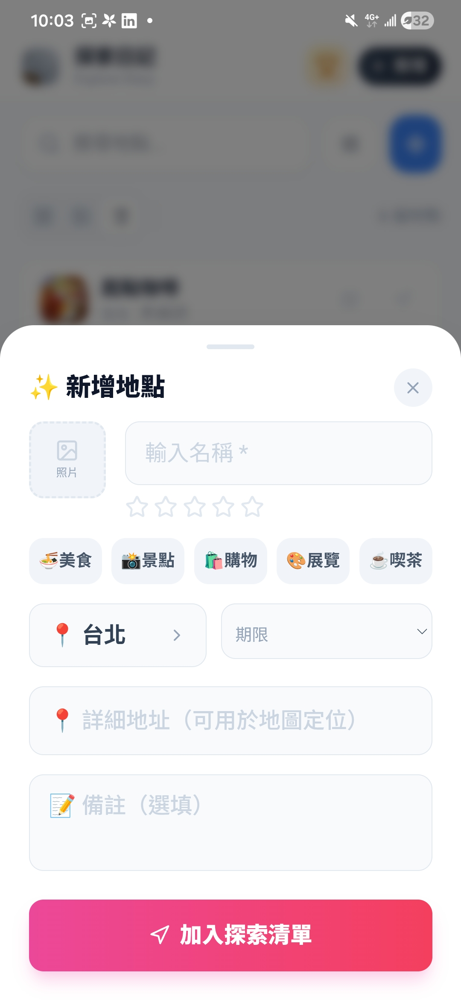
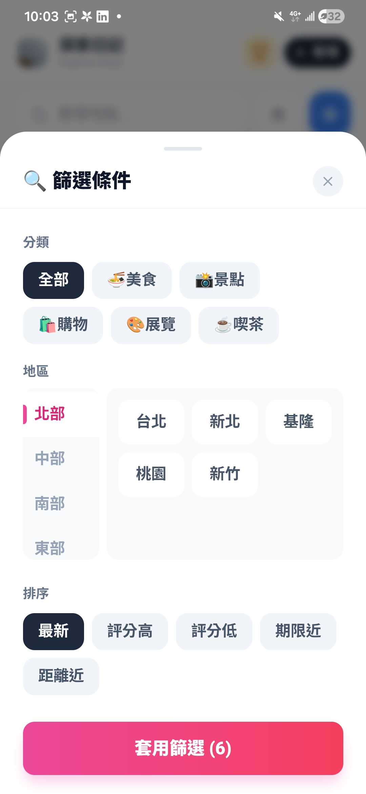
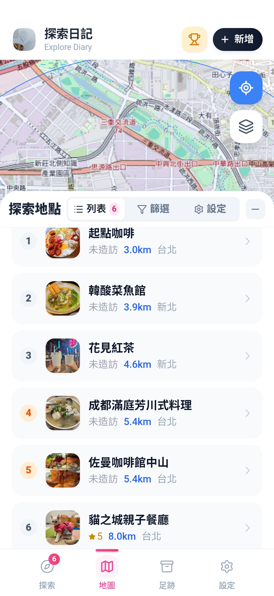
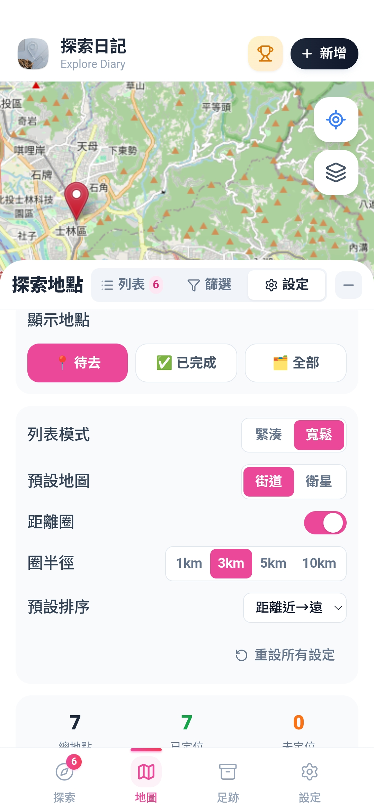
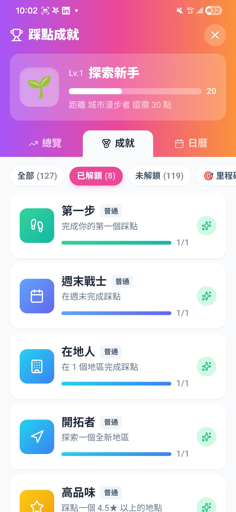
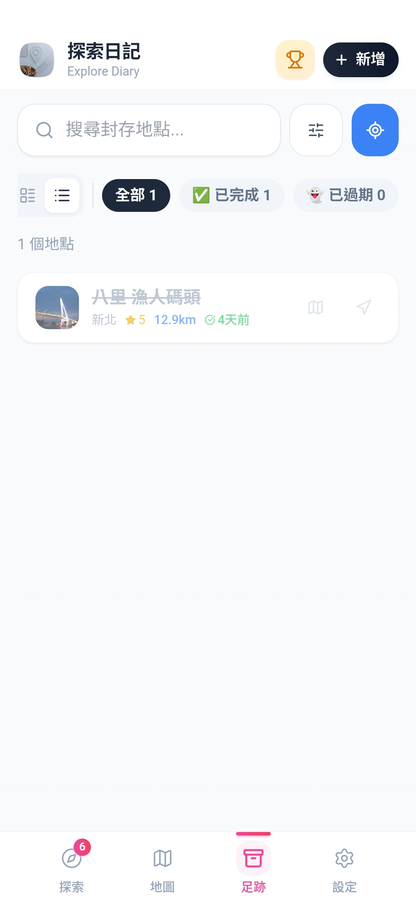
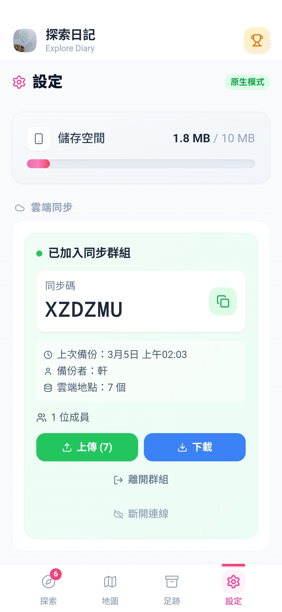
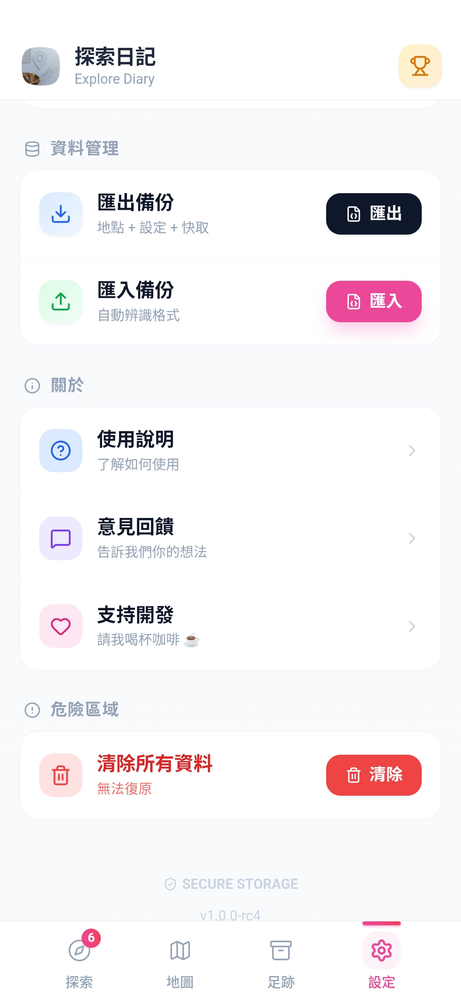

# 探索日記 · Explore Diary

### *把想去的地方，變成真正的故事*

 

<!-- 打賞按鈕 — 將連結替換為你的帳號 -->

&nbsp;&nbsp;

 

&nbsp;

 

---

## 📖 這是什麼？

**探索日記** 是一款專為旅遊愛好者設計的 **踩點記錄 App**。

你是否常在社群媒體上看到心動的餐廳或景點，卻在真正想去的時候找不到？  
探索日記讓你隨手收藏這些地方，造訪後留下記錄，讓每一段旅程都有跡可循。

🌐 **官方網站**：[https://xuanxuan-tech.github.io/Meow-Wanderer/](https://xuanxuan-tech.github.io/Meow-Wanderer/)

---

## 📲 下載

*上架後將更新連結*

---

## ✨ 功能介紹

### 📍 探索清單 — 收藏所有心動地點

三種顯示模式自由切換，找到最舒適的瀏覽方式。

&nbsp;&nbsp;&nbsp;

▲ 大圖卡片模式（左）・緊湊列表模式（右）

 

支援五大分類標籤：

| 🍽️ 美食 | 📸 景點 | 🛍️ 購物 | 🎨 展覽 | ☕ 喜茶 |
|:---:|:---:|:---:|:---:|:---:|
| 餐廳、小吃 | 公園、古蹟 | 市集、百貨 | 藝文活動 | 咖啡廳、甜點 |

---

### ✨ 新增地點 & 篩選條件

隨手記下心動地點，多維度篩選找到今天想去的地方。

&nbsp;&nbsp;&nbsp;

▲ 新增地點表單（左）・多維篩選條件（右）

 

- 📷 附照片、輸入地址、設定探訪期限與備註
- 🔍 依分類 / 地區（北中南東）/ 評分 / 距離篩選
- ↕️ 排序：最新、評分高低、期限近、距離近

---

### 🗺️ 地圖導航 — 規劃你的探索路線

&nbsp;&nbsp;&nbsp;

▲ 地圖列表（距離排序）（左）・距離圈與地圖設定（右）

 

- ⭕ 距離圈：1 / 3 / 5 / 10 km 自由設定
- 🗺️ 街道 / 衛星地圖切換
- 🧭 一鍵導航前往目的地

---

### 🏆 踩點成就系統 — 越探索越有成就感

共有 **127 個成就徽章**，累積踩點經驗值不斷升級。

▲ 踩點成就面板 — 目前等級：Lv.1 探索新手

 

| 徽章 | 成就名稱 | 解鎖條件 |
|:----:|:--------:|:--------:|
| 🌱 | 第一步 | 完成第一個踩點 |
| 📅 | 週末戰士 | 在週末完成踩點 |
| 🏙️ | 在地人 | 在同一地區累積踩點 |
| 🧭 | 開拓者 | 探索一個全新地區 |
| ⭐ | 高品味 | 踩點 4.5★ 以上地點 |

---

### 📦 足跡記錄 — 回顧每一段旅程

▲ 足跡畫面 — 顯示已完成踩點的地區、評分與時間

---

### ☁️ 雲端同步 & 資料管理

&nbsp;&nbsp;&nbsp;

▲ 雲端同步設定（左）・匯出匯入備份（右）

 

- 🔐 透過**同步碼**加入群組，一鍵上傳 / 下載備份
- 📦 支援匯出備份（地點 + 設定 + 快取）
- 📂 自動辨識格式匯入還原
- 🛡️ 資料採 **SECURE STORAGE** 安全儲存

---

## 📋 版本資訊

| 項目 | 內容 |
|------|------|
| 目前版本 | `v1.0.0-rc4` |
| 平台支援 | Android |
| 本地儲存上限 | 10 MB |

---

## 🔒 授權聲明

本專案採用 [CC BY-NC-ND 4.0](https://creativecommons.org/licenses/by-nc-nd/4.0/) 授權

> 未經授權禁止任何形式的商業使用、修改或轉售。

---

## 💬 聯絡與回饋

- 🌐 **官方網站**：[xuanxuan-tech.github.io/Meow-Wanderer](https://xuanxuan-tech.github.io/Meow-Wanderer/)
- ❓ **使用說明**：App 內「設定 → 使用說明」
- 💬 **意見回饋**：App 內「設定 → 意見回饋」
- 🐛 **Bug 回報**：請至 [Issues](https://github.com/xuanxuan-tech/Meow-Wanderer/issues) 提交

---

*記錄每一段值得走訪的旅程，讓旅途中的美好不再消逝。*

 

Made with ❤️ by **獨立工作室**

 

